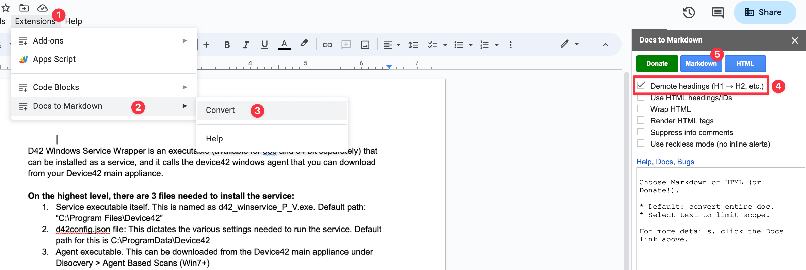

# Converting Google Docs to Markdown

If you have a Google Doc with standard Google Doc formatting, you can convert it to Markdown using the [gd2md extension](https://github.com/evbacher/gd2md-html/wiki#).

Once installed, you'll find it in the extensions menu.

Normally you want to use the 'demote headings' option, but it depends on what heading levels the Google Doc author used.

Once you've run the add-on it will copy the markdown version to your clipboard. You can paste it into a markdown file and save it.

To get the images, download an HTML version of the entire document. This will give you a `.zip` file with a subfolder with all the images. 

For each image, the markdown will have a warning added in the HTML that the image might be wrong, as the downloaded images are out of order. You need to manually check each image and change the name if necessary for the markdown version.
