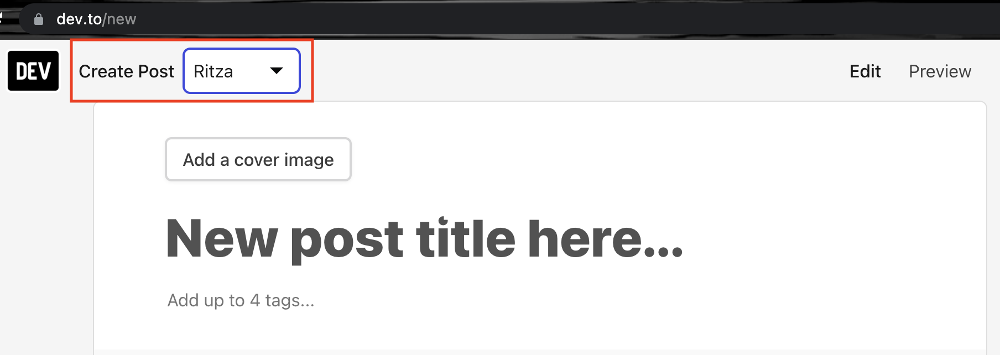
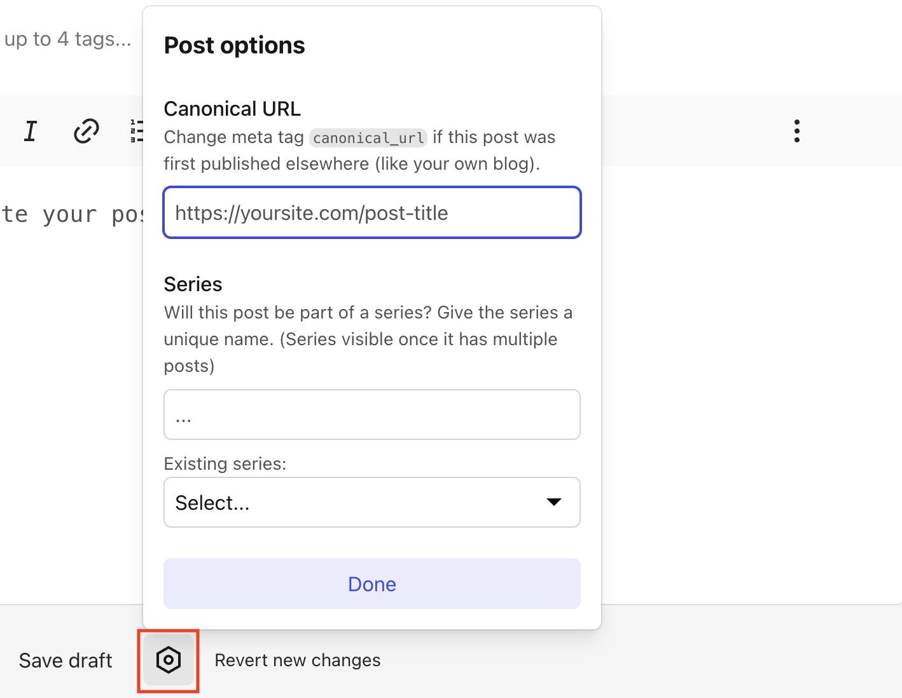
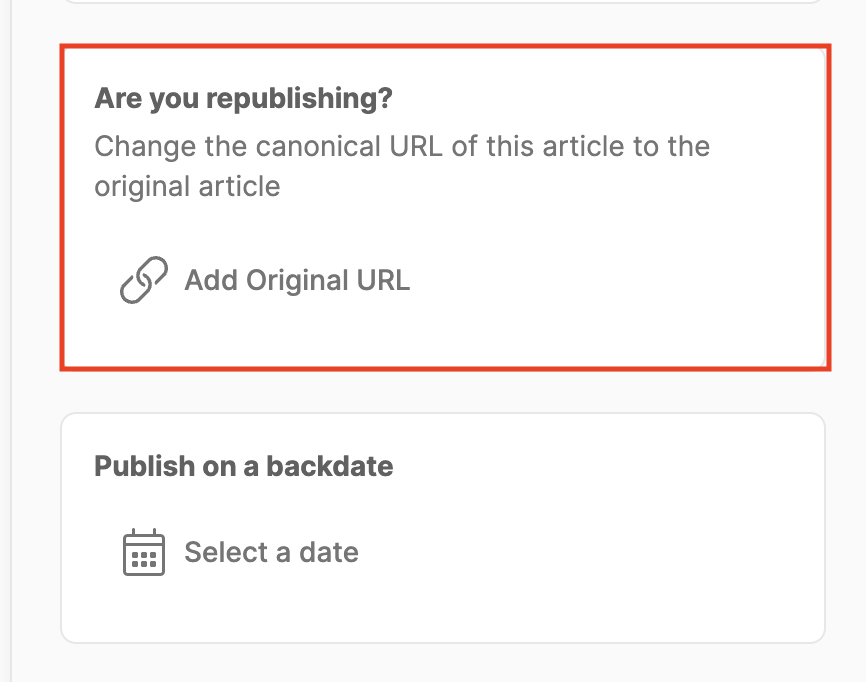
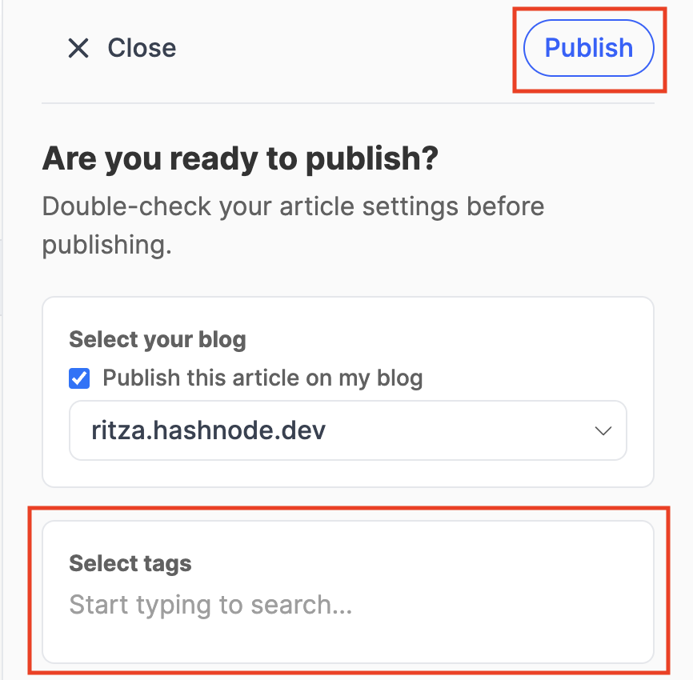

# How to Cross Post to Ritza's Social Accounts

Ritza publishes the content it creates for clients across its social media channels and blogs. At the time of writing this article, these social channels include [Dev.to](https://dev.to/ritzaco), [Hashnode](https://ritza.hashnode.dev/) and [Beginner Python Projects](https://beginnerpythonprojects.com/).

This guide contains detailed instructions on how to cross post to the above mentioned channels.

## Dev.to 

Sign into our Ritza branded account on `dev.to`. Ask Gareth for the password if you don't have access. 

1. Create a new post. Make sure you that you create it as "Ritza"

2. Copy the markdown content of the post from GitHub into the editor by visiting the 'raw' page, using "Ctrl + A" to select all the text, and copying it to your clipboard with "Ctrl + C".
3. Edit any images to make sure they display: relative links such as `/images/myimage.png` will need to be changed to absolute links such as `https://example.com/images/myimage.png` depending on where the original post was hosted)
4. Remove any extra HTML formatting and blocks. For example, `` tags should be converted to markdown format: ``
5. Convert any relative links like `See [part 1](./part1.html)` to absolute links `See [part 1](https://example.com/part1.html)`. Always link to the original canonical link rather than the dev.to version of other linked posts.
6. Replace any `<iframe>` (for example to a linked repl) to a simple link instead. For example, "See the example repl below" should be "You can find the example repl at https://replit.com/@ritza/my-repl"
7. Include the Canonical URL for the article or the URL for the original post. To do this, click on the hexagon shape at the bottom of the "Create Post" page and enter the Canonical URL in the popup that appears. This should usually link to our customer's domain for that post (not our GitHub).
8. Add 3-4 relevant tags before publishing. Ask on Slack if you're not sure what tags to use.

## Hashnode

Click on the Ritza profile icon to the top right section of the [Ritza Hashnode](https://ritza.hashnode.dev/) dashboard. On the dropdown that appears click "Start New Article" and you'll be redirected to the "Create Post" page. Once there, you should paste the same version of the article that you posted on Dev.to with the absolute links and not relative links. 

- In order to set the canonical url for a Hashnode post, click on the "Publish" button on the top right section of the "Create Post" page. This should trigger an options screen to slide in from the right. Scroll to the bottom of this options screen until you find a section titled "Are you republishing?". Paste the canonical url in the field named, "Add Original URL".

- You should also include tags for your post. To do so, scroll to the top of the options screen and you will find a section titled, "Select tags". Add any tags there that are relevant to the article you're about to post.

- Finally, when you're done you can click on the "Publish" button.

## Beginner Python Projects

On Beginner Python Projects we don't post the actual article itself but only a reference to where the original article is hosted. If an article doesn't have a cover image you should create one for it using [canva](https://www.canva.com/) or any other editing tool of your choice. 

The structure of posts on Beginner Python Projects should follow the format below: 

- Write the title in the "Post title" field 

- Add the cover image using the "Add feature image" option at the top of the screen

- Include a "**Where is it?**" bold heading below the title with the text "Find the tutorial here" beside it. Please note the "here" should link back to the original article.

- Include a "**What is it?**" bold heading below the "Where is it?" heading. Beside the "What is it?" heading you should write a short description about what the tutorial is about and what readers can hope to learn after going through it.

- Include a "**What you need to follow?**" bold heading below the "What is it?" paragraph. Write a short description besides the "What you need to follow?" heading talking about what readers need to have in order to complete the tutorial for example prior programming experience level and any tools used in the tutorial. 

- Click on the rectangle icon to the right of the "Publish" button and an options screen should slide in from the right. On this screen you should:
    - Add any tags relevant to the article you're posting under the "Tags" section. 
    - Write an excerpt in the "Excerpt" section. An Excerpt is a short description of what the tutorial is about.
    - Remove your personal account as the author and instead set the Ritza account as the author.
    - Add meta data for the article by clicking on the "Meta data" section below the "Authors" section. 

- When you're done you can click on the "Publish" button to publish the article.

*bold test*

\*bold test*