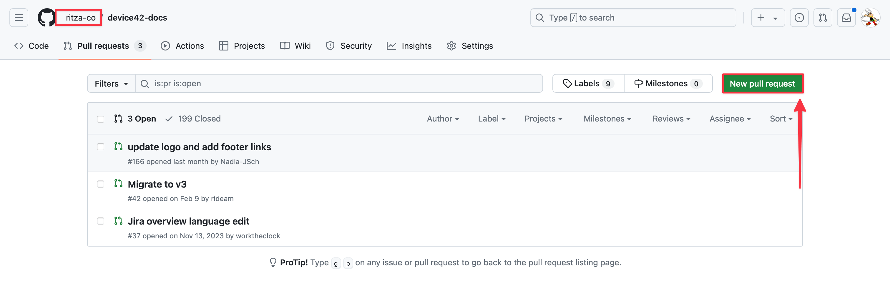
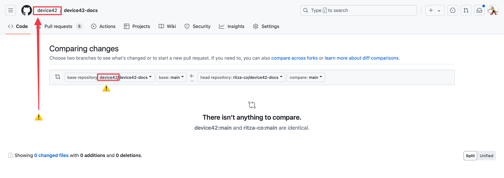
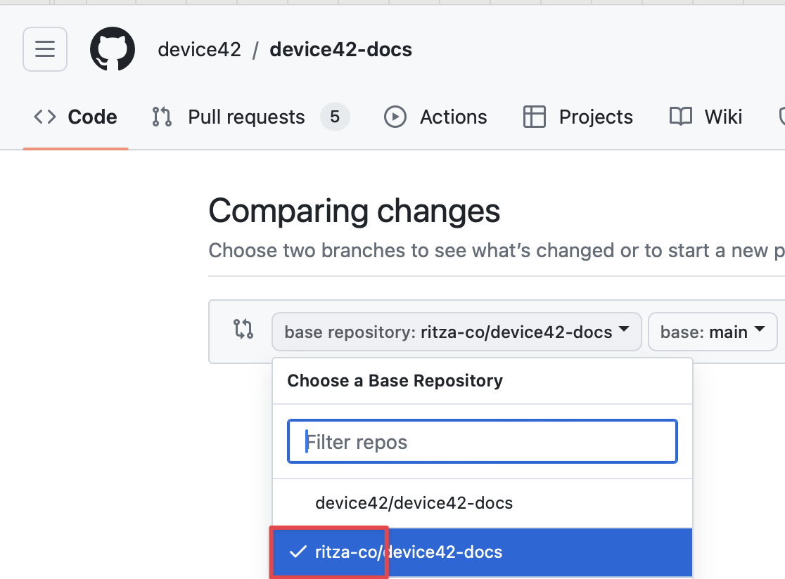
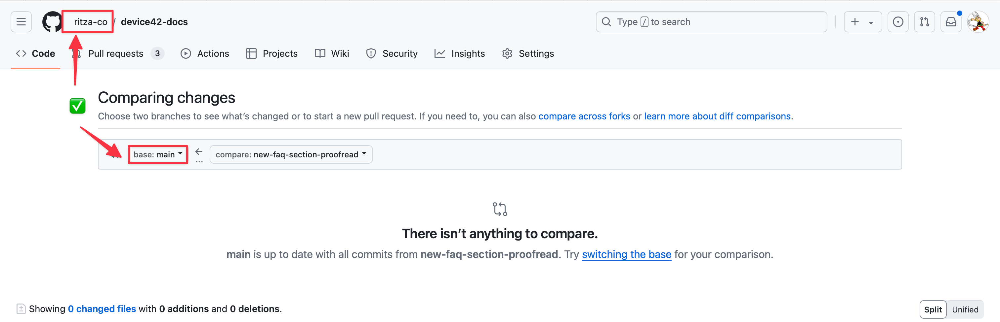

# Open a pull request for internal review 

For most of our projects, we keep a **fork** of our customer's project in our own GitHub organization.

Internally, we create one or more **branches**.

Once we're happy with a deliverable, we open a **pull request** back to the **upstream** repository. At this point, it is visible to our customer.

If you're not used to git terminology or GitHub this seem pretty confusing, but luckily everything on GitHub is reversible. 

The only slightly bad thing you can do is open a PR externally (to our customer) by mistake. Unfortunately GitHub makes this **very easy** to do by defaulting to this, so you need to be careful.

1. Navigate to the "PR" tab in our GitHub organization of the repository you want to open a PR to.
2. Click "New Pull Request"

3. ⚠️ At this point GitHub will default to opening the PR directly to our customer. This is probably not what you want.

4. Change the "Base repository" back to the `ritza-co` version.

5. Verify that you're in our org (ritza-co is shown in the top left) and that you're not opening a PR between forks.

Now you're good to open the PR.

