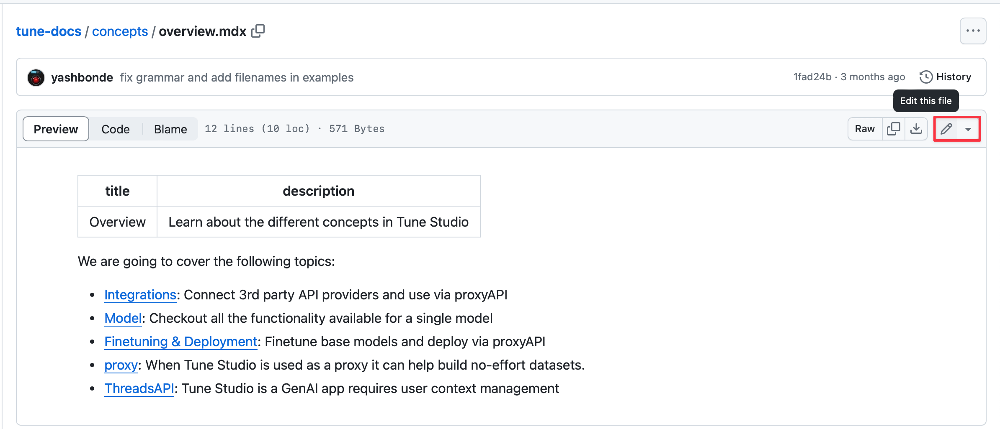
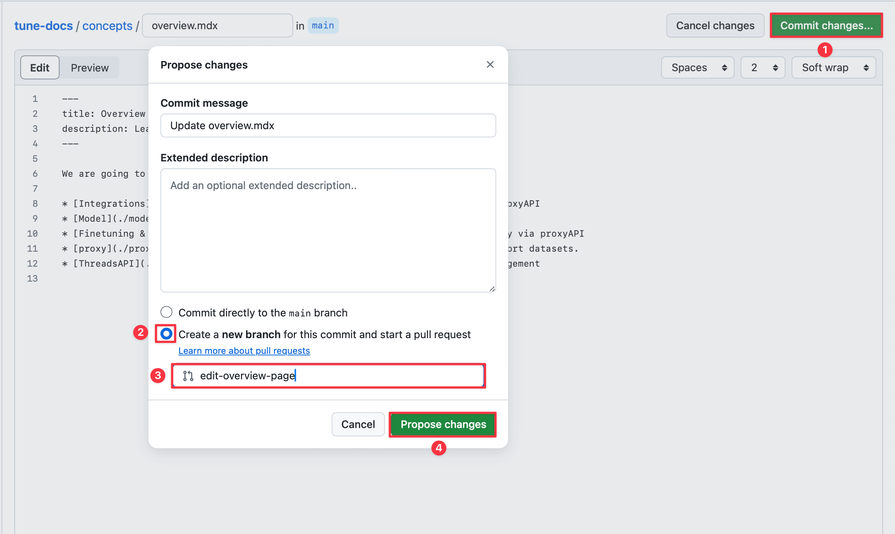

# Open a pull request using the GitHub editor

If you're only making text changes to a file, you can often do it directly through the GitHub editor without needing to use git locally.

The limitations of this approach are that you need to make one commit and one branch per page, but often that's what we want anyway.

Here's how:

1. Click the edit icon to go into editing mode.
2. Make any changes to the text using the editor.

Once you're happy with the draft:

1. Click "Commit changes"
2. Choose the "Create new branch" option
3. Give your branch a name that summarizes what it's for, e.g. 'edit-overview-page'. We usually start with a verb like 'add', 'remove', 'fix', 'edit' and follow with a short description of what it touches, with all lowercase and hypens.
4. Press "Propose changes"

