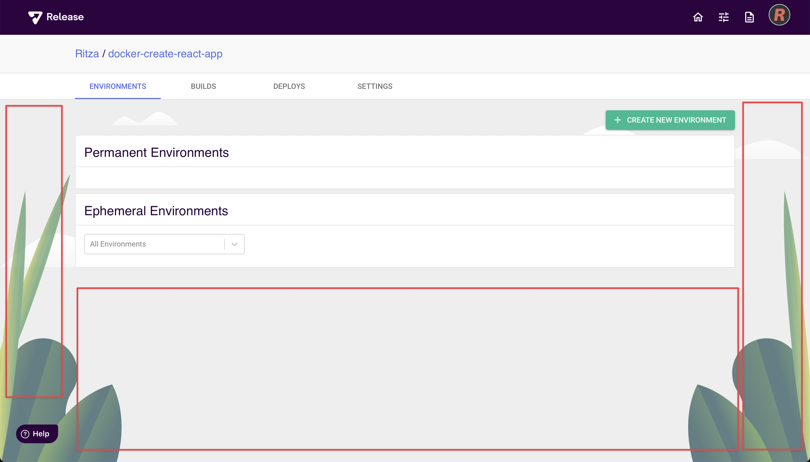
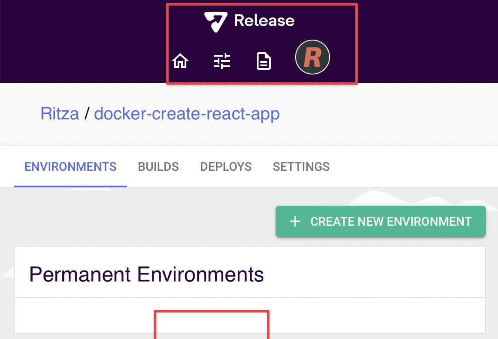
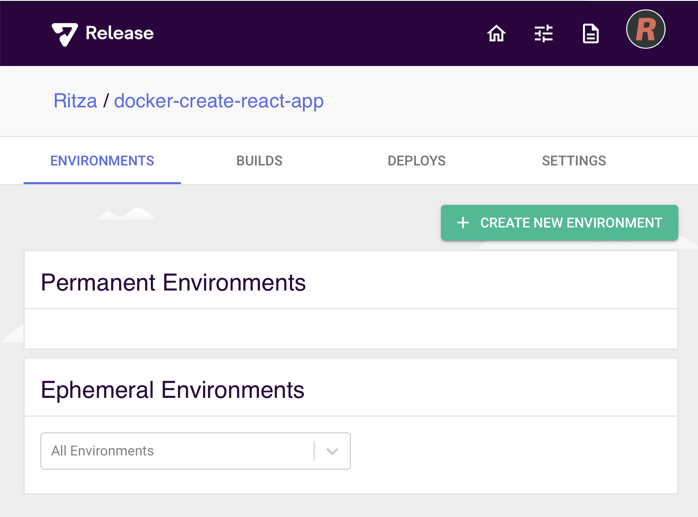

# Screenshots

* Take screenshots on a 4k or retina monitor.
* Annotate screenshots using CleanshotX
* Use red rectangles with the second thinnest line width to call out specific buttons, inputs etc
* Use a red arrow if necessary to draw the reader's attention to hard-to-spot elements
* Use red numbered steps if 3 or more steps are shown on a single screenshot
* Make the window smaller if possible, but not if it messes with the UI elements

In the first image below, the window is too big, leaving a lot of empty space. In the second one, it's too small as some mobile responsive changes have already been applied so the screen is different from how most readers would see it. It also cuts off the "ephemeral environments" panel. The last screenshot is good.

* Use TinyPNG to optimize filesize for all screenshots
* Use browserframe with "Generic light" browser and background colour of `29063e` 
* Put screenshots in the `.gitbook/assets` directory
* Name screenshots with a prefix that is the same or similar to the markdown file -- e.g. if you're working on `rainbow-deployments.md` then screenshots can be called `rainbow-deployments-overview.png`, `rainbow-deployments-namespaces-overview.png` etc
