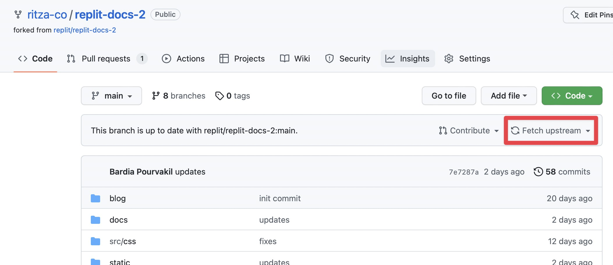
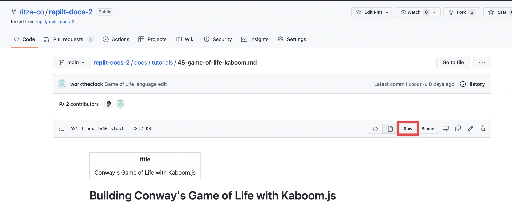

# Finding the equivalent URLs and content in different places

## How to find the GitHub page from the docs.replit.com link

The URLs on docs.replit.com are built from the folder structure in the GitHub repository. In order to find the editable version of a specific page.

1. Visit our fork of the Replit docshttps://github.com/ritza-co/replit-docs-2
2. Press "Fetch upstream" to bring in any changes from their version

3. Navigate to the `docs` folder by clicking on it in GitHub.
4. Look at the last two parts of the URL from the docs.replit.com link. In this example, they are `tutorials/game-of-life-kaboom`: https://docs.replit.com/tutorials/game-of-life-kaboom
5. In GitHub, click on the first part (tutorials in the example above) and then the second part with a `.md` extension (game-of-life-kaboom.md) [NOTE: sometimes there will be an extra number, so in this example it's actually `45-game-of-life-kaboom.md`]
6. Click on the file
7. If you need the raw markdown version, click on 'raw' 

You can also build the URLs manually as they follow the following patterns.

Raw link:
`https://raw.githubusercontent.com/ritza-co/replit-docs-2/main/docs/tutorials/45-game-of-life-kaboom.md`

Edit link:
`https://github.com/ritza-co/replit-docs-2/blob/main/docs/tutorials/45-game-of-life-kaboom.md`

