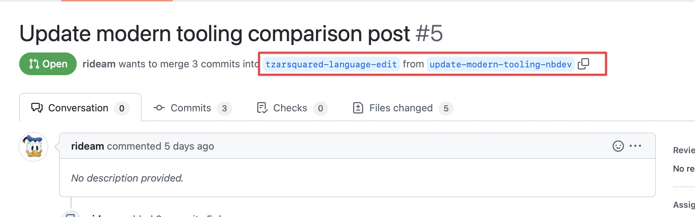

# ReviewNB

* ReviewNB's main blog repository is in GitLab. We have a fork in GitHub.
* We have a shared GitLab account that you can use to authenticate with their (private) repo.
* Drafting, editing and QA should happen in our GitHub
* This branch can then be pushed to GitLab for their feedback
* Once the branch exists in GitLab, you can use the GitLab UI to open a pull request and get feedback from ReviewNB

## SEO and target audience

* TODO

## Coordinating drafting, QA, editing

Generally, our flow is draft -> QA -> editing. In theory

* The author creates an `add-foo-article` branch off `main` (GitHub) and adds the draft
* QA branches off there with `qa-foo-article` and opens a PR to `add-foo-article`
* Editing branches off their with `language-edit-foo-article` and opens a PR into `add-foo-article`
* Ideally the QA branch should be merged before the editing branch is created
* In reality, these things might happen in different orders and people might branch off each other's branches instead of the main one
* Therefore, the technical producer also needs to keep up with this process and ensure that the right merges happen or create these.

EXAMPLE

In the following, you can see that the language edit branch was created first, and the QA branch is now going into the language edit branch. This means that if you take the following steps

1. Merge the language edit branch into the draft branch
2. Merge the QA branch into the language edit one

Then the QA updates will be lost and won't make their way into the draft branch.




So in this case, it's important to first 

1. Merge the QA branch into language edit
2. Merge language edit into draft

Meaning that both QA and language edit changes will reflect in the draft branch.

## Timing

One of the best ways to 'create' time for the team is by making sure we don't have any wasted time between stages. So the draft should be given to QA as soon as possible after the author is done, and to editing as soon as possible after QA is done. Ideally, each stage hands over to the next one, but sometimes it needs a nudge. Similarly, we should get feedback from the customer as soon as possible after editing is done to overall reduce the the time from brief -> publication.

## Setting up GitHub and GitLab remotes locally

You should have the code locally on your machine connected to both GitHub and GitLab remotes. You can use the GitHub UI to merge pull requests (e.g. editing, QA) into the draft branch. Once it's ready, you can push the draft branch to GitLab using the CLI and open a PR from the gitlab:draft-branch -> gitlab:main using the GitLab UI.

Clone our repository as `origin` and set theirs as `upstream`.

```
git clone git@github.com:ritza-co/reviewnb-blog.git
cd reviewnb-blog.git
git remote add upstream https://gitlab.com/amit1rrr/reviewnb-blog.git
```

Now you can push commits from our repository to branches in their repository. 

```
# fetch all updates from GitHub
git fetch origin

# switch to the draft branch
git checkout <draft-branch>

# push it to GitLab
git push upstream <draft-branch>
```

After running the last command, you'll get a link that lets you create a PR in the GitLab UI into main, which can be reviewed by ReviewNB before being merged.


```
reviewnb$ git push sandbox test
Enumerating objects: 6, done.
Counting objects: 100% (6/6), done.
Delta compression using up to 10 threads
Compressing objects: 100% (3/3), done.
Writing objects: 100% (6/6), 456 bytes | 456.00 KiB/s, done.
Total 6 (delta 0), reused 0 (delta 0), pack-reused 0
remote:
remote: To create a merge request for test, visit:
remote:   https://gitlab.com/ritza-co/sandbox-2/-/merge_requests/new?merge_request%5Bsource_branch%5D=test
remote:
To https://gitlab.com/ritza-co/sandbox-2.git
 * [new branch]      test -> test
```

