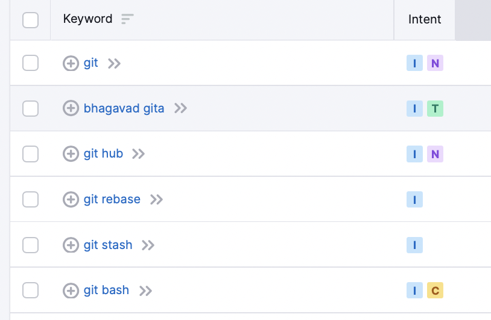
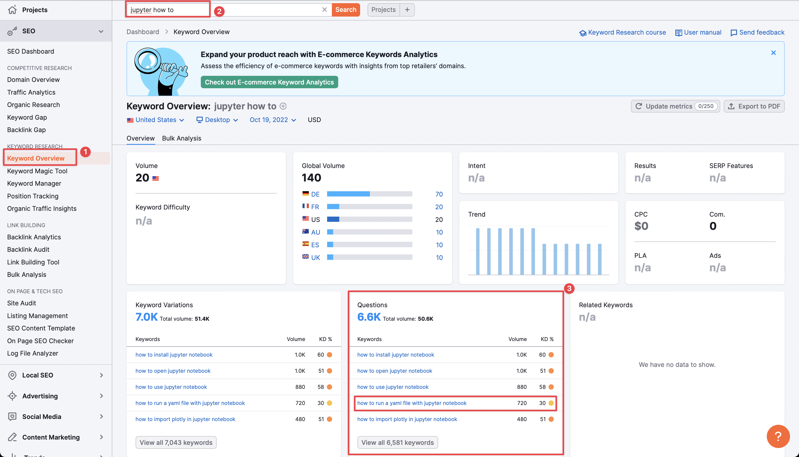

# SEO, strategy and research

In an ideal world, our writers are exactly part of the target audience: they write the articles they would want to read, and no further research is needed.

In the real world, it's not so simple. Our writer might not perfectly belong to our customer's target market, or our writer might have interests that are too niche. Often, there will be thousands of readers searching for a specific answer but using unexpected phrasing - so the writer might have written an article that thousands of people want to read, but they can't find it because they aren't searching for the keywords the writer expected.

The most popular topics have thousands of almost identical articles competing for views. Even if there are only 3-4 good articles, we're not helping our readers, writers, or customers by adding yet another one to the list.

When deciding topics and titles, you should be aware of 

* Who your target reader is (there's no point getting lots of views from people looking to buy Ice Cream if you sell enterprise software)
* What problems these readers have
* What questions these readers are asking Google to solve their problems

## Intents: navigational, informational, transactional, commercial

Semrush tries to automatically classify search queries by **intent**. What does the reader intend to do after executing this search? The categories are 

* Navigational: e.g. the user searches for "Facebook" because they want to visit facebook.com. We can usually ignore these as the user is just going to click on the site they already want and ignore everything else.
* Information: The user wants to answer a question that they have (they might not have searched this question directly though)
* Commercial: The user is investigating brands or services
* Transaction: the user wants to complete a specific action

You can see more information and examples about each type of query [here]https://www.semrush.com/blog/types-of-keywords-commercial-informational-navigational-transactional/). 

For each keyword, you can see the category by the little different coloured letters, as shown below.

While most marketers focus on transactional or commercial intents, we focus on information ones -- our goal is to provide free knowledge for readers, and the best way to do this is by answering their questions or solving their problems.

## Keyword research: volume and keyword density

Some keywords already have a lot of content relating to them - these are usually (but not always) competitive. Other people have already said everything there is to say about the topic and there's nothing we could really add. This isn't always true though -- 99% of content on Google is of very very low quality, so being in the top 1%, even for competitive keywords, isn't actually as hard as it sounds.

Some keywords are high volume: a lot of readers are searching for this topic. Most high volume keyworsd are also high density -- popular topics have more content.

Sometimes you'll find a high-volume, low-density keyword: lots of people are searching for information on something and not much information exists. These are great 'gaps' to try fill, but of course other people are using exactly the same strategy to decide what to write about, so the gaps often fill up and you end up with a bunch of different places writing the same article at the same time because they found the same 'gap'.

In the example below, YAML and Jupyter Notebook looks like a potential gap - a low keyword density and high volume.

But if you look more closely by clicking on the keyword, you'll also see the "trend" -- it looks like this might just be a temporary spike from some anomaly (e.g. maybe a huge online course had an assignment about Jupyter + YAML so all their students googled it in the same week and then never again).

## Finding keywords

This is the creative part - try to imagine what your readers might be searching for, what problems they might have, and then test your hypotheses using Semrush.

Even though Semrush automatically adds related questions for specific keywords, you can also add things like "how to" and other question words to your keyword search to focus more on questions.

Volume is relative: if you're doing topics in a niche area, volume is going to be a lot lower for all topics (e.g. 100). If you're doing topics related to somethign popular like Python, you'll find many keywords with volumes in the 1k-10k+ range).

Look for questions with high volume and keyword density that are difficult to answer (e.g. if you can answer the question in one line, it's probably not a good topic for an article). 

## Related topics

For very niche topic areas, it's often more interesting to search for something related and less niche. For example, everything related to Jupyter is very low volume, but there's a lot more volume for topics around Matplotlib. If the customer is interested in helping Jupyter users, we can assume that many if not most Matplotlib users use Jupyter at least sometimes.

E.g. maybe they are searching for how to create a specific graph in Matplotlib, and don't even mention Jupyter in their query, but we can assume that they use it sometimes. An article that fixed their problem by giving them the code they needed and explaining how/why it works could also mention a related problem that they might not even know they have about Jupyter notebooks.

