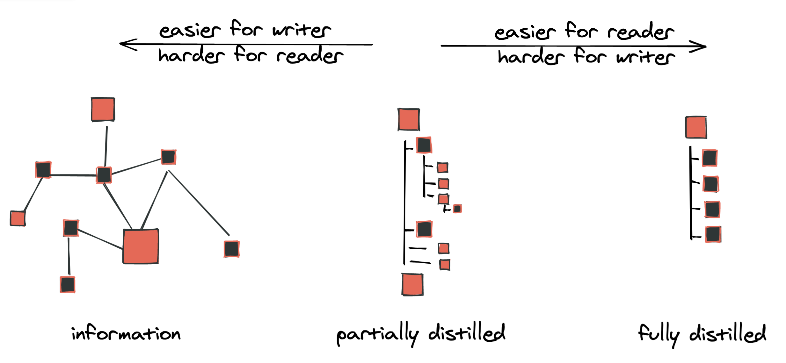
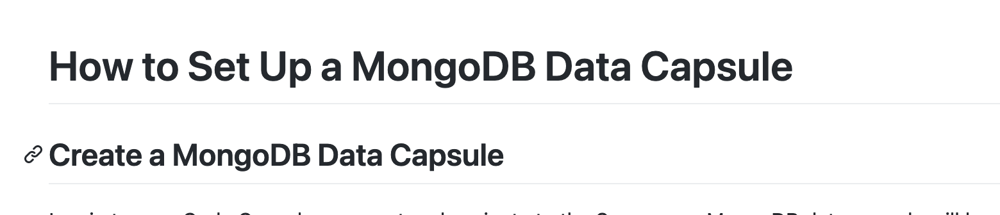

# 📝 Welcome to the Ritza style guide

This is our opinionated style guide, developed to help you produce work that is valuable and easy to understand.

## Goals and principles

Our goal is always to **teach**. This often means helping our readers understand complicated technology, either conceptually or by example. Give your reader the exact information they need and include opportunities for them to learn more.

To achieve our goal, our content is:

* **Clear.** Be sure you know what you’re writing about. Keep words and sentences as simple as possible.
* **Useful.** Does the content deliver on the promise your headline made? Have you provided all the information the reader will need?
* **Friendly.** Don’t underestimate or patronize your reader. Use informal language.

## Voice and tone

Voice and tone is not about what we say, but how we say it. We aim to be consistent, functional and clear. Here are some tips for how to achieve this:

### Point of view

Default to **first person plural** to include the reader in your “team”. This means you and the reader are doing something together:

✅ "Next, we'll install the widget factory to create widgets efficiently."

Sometimes it's more efficient to use the **second person imperative** and "instruct" the reader by telling them what needs to be done. This can be harsher but it's often less wordy, so use your judgement:

* ⚠️ "We can do this by using our package manager. We'll achieve this by typing `sudo apt-install widget-factory`"
* ✅ "We can do this by using our package manager. Type `sudo apt-install widget-factory`"

It's ok to refer to the reader as 'you' in some cases, where the writer is clearly not involved, but in general, default to the 'we' voice wherever possible:

* ⚠️ "As you might remember from the [previous tutorial](#), widget factories create widgets. In this tutorial..."
* ✅ "In the previous tutorial, we saw how widget factories create widgets. In this tutorial..."

### Voice

Default to **active voice**. This isn’t a hard-and-fast rule. Active voice often makes it clearer who is doing what and sounds less stuffy. That said, sometimes passive is simply cleaner (often in cases where there isn't a specific subject) - use your judgement.

* ⚠️ The command will be run by the shell.
* ✅ Use the shell to run any commands.

### Things to avoid

#### Avoid giving the reader too many options

Often, there are many ways to achieve the same task. Avoid giving the reader options wherever possible - the reader is looking to you for guidance, so be **opinionated** instead of **comprehensive**.

* ❌ "You can use either the CLI or the GUI. If you prefer the CLI, then type the following command. If you prefer the GUI then click Foo -> Bar.
* ✅ "We recommend using the CLI. Type the following command"

If you really need to show multiple ways of achieiving the same thing, still emphasise the recommended one more than the other (e.g. include the alternative in a footnote or parentheses). It is OK to have a personal preference.

#### Avoid getting in the reader’s way:

* ❌ "I wrote this guide after encountering difficulties with the software myself"
* ❌ "Next, I'm going to show you how to install a widget factory"

#### Avoid 'marketing' speak.

Never try to sell something to the reader. Don't say a product makes things easy, that a design is beautiful, or use any text that you might find on a SaaS landing page.

#### Avoid anything you might find in an encyclopaedia or academic paper.

Your reader isn't interested in definitions - or if they are, they can easily find these elsewhere. 

If you're writing an article on NER, instead of starting with

❌ "Named Entity Recognition (NER) is the task of categorising key words in a text as specific entities."

Consider something more like 

✅ "If you're analyzing a large amount of text, it's often useful to extract named entities from this - identifying people, places, dates and other entities."

If you've ever tried to learn a new concept, you probably already know that reading a definition doesn't really clarify - but a more specific example does.

#### Avoid assuming knowledge.

This can be tricky because, of course, you always have to assume _some_ level of knowledge when writing technical content. However, we try to avoid assumptions about our reader's skill level. 

* ❌ "Referring back to the server code, it's obvious that we need both a success.html and a cancel.html."
* ✅ "Referring back to the server code, you may notice it requires both a success.html and a cancel.html."

#### Avoid guessing out loud what the reader wants.

It's tempting to start an article with "Are you are a foo who likes to bar but sometimes finds baz?", but this approach defines a narrow audience and you risk alienating anyone who is not a part of it.

#### Avoid giving extraneous context.

It's tempting to give the reader related context or information, but your reader is here to achieve a specific goal. Leave out anything that doesn’t help them achieve it.

Instead of:

❌ Label Studio is an open source data labeling tool for labeling and exploring multiple types of data. Label Studio can be integrated with machine learning models to supply predictions for labels (pre-labels), or perform continuous active learning. You can use Label Studio for a variety of labelling and classification tasks for many different data formats but again we will just be focusing on its NER capabilities.

Try something more concise:

✅ We can use Label Studio for manually tagging Named Entities in our dataset. Install it now with `pip install label-studio` if you haven't already.

#### Avoid telling the reader that something is obvious or easy.

This discourages the reader who doesn’t find it obvious or easy, and adds no value to the reader who does.

Mostly, `~it's simple~`. You can `~easily~` `~just~` remove the offending words and the sentence keeps its meaning:

* ❌ Obviously, you can terminate the program at any time by hitting `Ctrl+C`
* ✅ You can terminate the program at any time by hitting `Ctrl+C`

Sometimes, you need to reword to avoid implying that something is simple:

* ❌ It's easy to add new widgets using Acme's tool. Click `menu` -> `add widget`.
* ✅ To add a new widget using Acme's tool, click `menu` -> `add widget`.

## Structure

The structure of your article helps to present information in the clearest way. Here are some things to keep in mind regarding structure:

### Keep structures as flat as possible.

Use heading 1 (`#` in Markdown) for the title and heading 2 (`##`) to break things down into logical sections. Heading 3 (`###`) can be used where necessary for sub-sections, but in general, having a deeply nested structure makes things harder to follow, harder to edit, and harder to reuse. As a writer, your job is to take a complicated graph of interconnected ideas and break them down into a linear structure that can be read from start to end.



## Always have content between headings

Don't have a subheading immediately below a heading without any text in between.



Rather add a short sentence to introduce the section, or try to restructure to use fewer headings (also, don't use this as an excuse to add 'fluff' text that adds no value to the article).

### Avoid nested bullets.

Don't nest bullets into several levels. Rather restructure the content so that you can use separate bullet lists:

❌ You have several options for adding widgets

* From the menu
    * by clicking on `file` -> `add widget`
    * by clicking on `help` searching for `add widget` and hitting `enter`
* With a keyboard shortcut
    * by pressing `a` and then `w` in command mode
    * by pressing `ctrl + a`

✅ You can add widgets from the menu

* by clicking on `file` -> `add widget`
* by clicking on `help` searching for `add widget` and hitting `enter`

or with a keyboard shortcut

* by pressing `a` and then `w` in command mode
* by pressing `ctrl + a`

### Link as much context as is useful.

Choosing what text to link to an additional resource is more an art than a science. The main rule is that it should be as clear as possible to the reader what is being linked to, but keep it simple. 

* ❌ "[You can follow the widget guide](#) to learn more"
* ❌ "You can follow the widget [guide](#) to learn more"
* ✅ "You can follow the [widget guide](#) to learn more"

The first example links too much unnecessary wording. In the second example, the link could be to a Wikipedia article explaining what a guide is. The third makes it clear that it is a link to the guide that was mentioned.

### Include user-friendly code samples.

We want to tell the reader exactly _what_ code needs to go _where_, and make it easy to repeat what we are doing. Avoid screenshots of code, and rather present code samples in text, between backtick gates with a language description.

### Avoid long code snippets.

Instead of giving an entire file to copy-paste, break down the code into several steps if possible.

### Provide a file, if you must.

If there's a lot of ‘boilerplate’ code, consider providing the file in a repl and instruct the reader to copy the whole thing as a starting point. However, it's preferable to avoid this if you can.

### Annotate screenshots and use context.

Screenshots are helpful tools for tutorials, but using them too often or without clarity may just make it harder for the reader to follow your instructions. 
 
* ✅ Use contextual screenshots to help readers navigate whichever platform you are directing them to.
* ✅ Use a screenshot to demonstrate what your reader should be seeing if they correctly followed your instructions. 
* ✅ Make use of [1], [2], [3] annotations if several things need to be shown from a single shot.
* ✅ Preferably take screenshots using a 4k/retina screen, or consider using a virtual high-res screen through Chrome dev tools as an alternative.
* ✅ For Mac, use CleanShotX if possible

* ❌ Avoid screenshots of large amounts of text. Rather use a caption if you need to present text to your reader. 
* ❌ Avoid screenshots that show too little; for example, just the button they must click. Where is this button in relation to the page? 
* ❌ At the same time, don't include so much in the screenshot that the reader isn't sure what you are trying to illustrate.

### Prefer code blocks to inline code.

It's ok to use markdown's single back-tick syntax to highlight a single word like "Notice the `for` statement below". For any code samples, even if only one line, rather use three backticks and have the code on its own line and in its own section.

❌ Now run `python3 app.py`

✅ Now run:

````
```
python3 app.py
```
````
